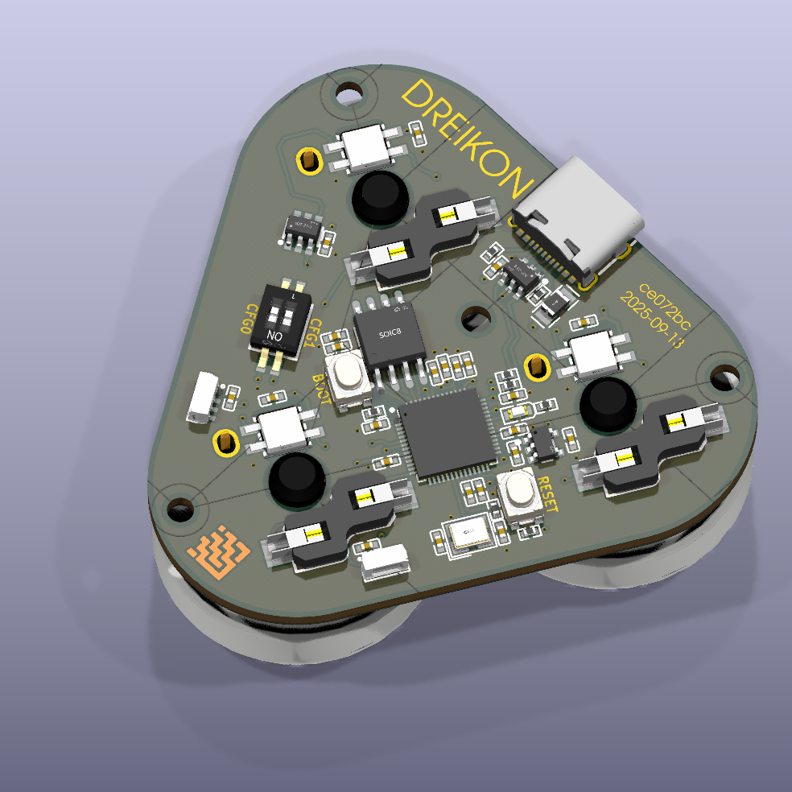

# DREIKON

## About

A triple button mechanical keyboard for all your macro needs.

## Features

- 3x hotswap sockets for Kailh low profile switches (CHOC v2)
- 3x RGB addressable LEDs for switch underglow
- 2x RGB addressable LEDs for front color bar
- USB Type-C
- 2x DIP switches for configuration
- RP2040 microcontroller

## Firmware

See the [firmware](./firmware/README.md) folder for info on setting up and using the firmware.
